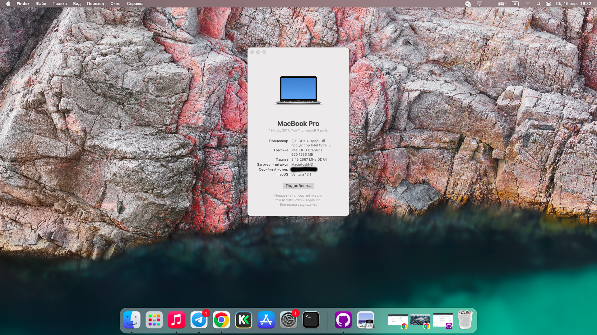

# OC-EFI-HP450G7
 EFI 0.9.0 - MacOS 13.1 - HP 450 G7

## About Notebook

| NAME |        VALUE           |
|-----|-------------------------|
| CPU | Intel Core i5-10210U    |
| RAM | 8GB DDR4 26667 Mhz      |
| WLAN/BT | Intel AX201         |
| iGPU | Intel UHD 620, no dGPU |
| Storage | NVME M.2 Crucial P1 |

### What work

- CPU with power management
- GPU full acceleration
- all USB-Ports
- Trackpad/Clickpad with all gestures
- native sound-keys
- Battery
- Sleep
- HDMI and 4k. Also USB-C to HDMI with 4k
- Bluetooth
- WLAN
- after approx. 3 hours of idle operation with 100% backlight brightness, the battery is at approx 50%.
- temperature is about 45° to 50° all over time. Very silent fan.
- WebCam (without internal micro)

### No testing

- native brightness-keys (only if you boot directly in MacOS after PowerOn or Hardware-EC-Reset). Otherwise fn+w is brighter and fn+c is darker
- AirPlay

### Dont work

- IR-Sensors
- SD-CardReader
- FingerPrint Sensor

## P.S

_don't forget to change "PlatformInfo" in OC-config with your own data_